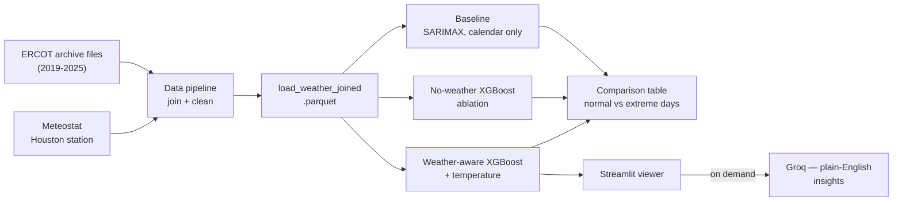
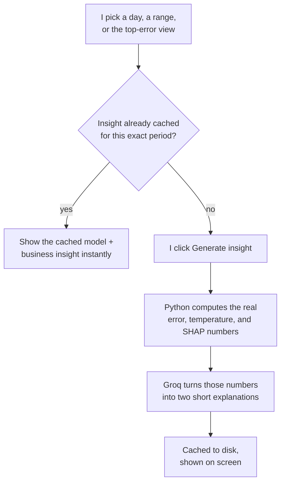
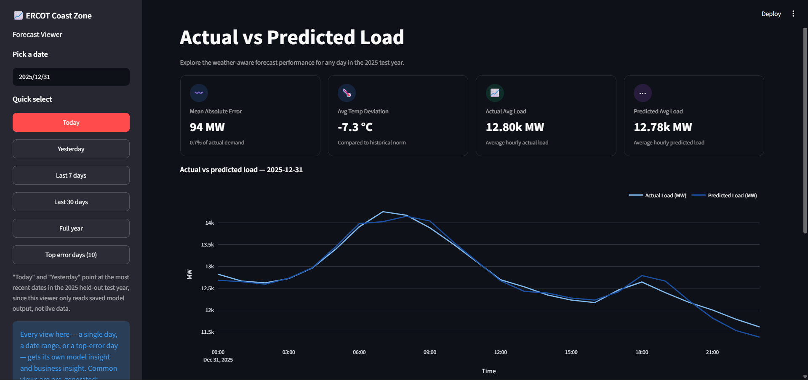
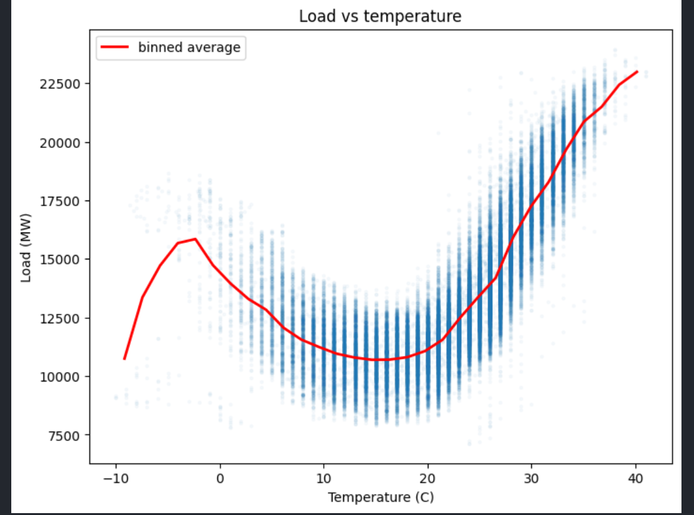
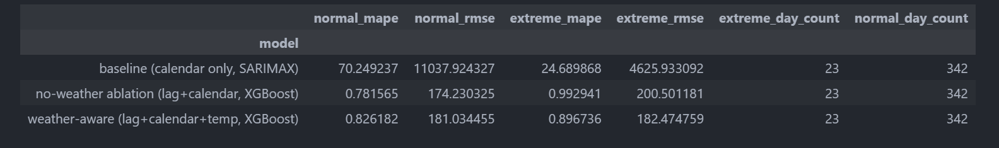
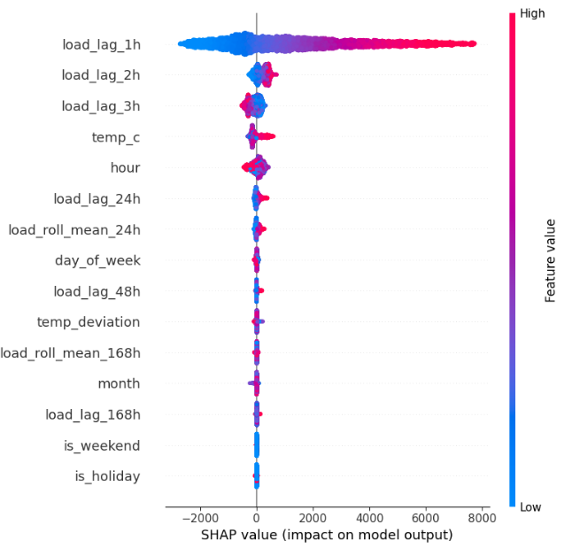
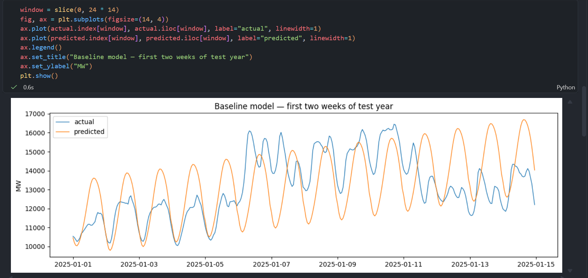
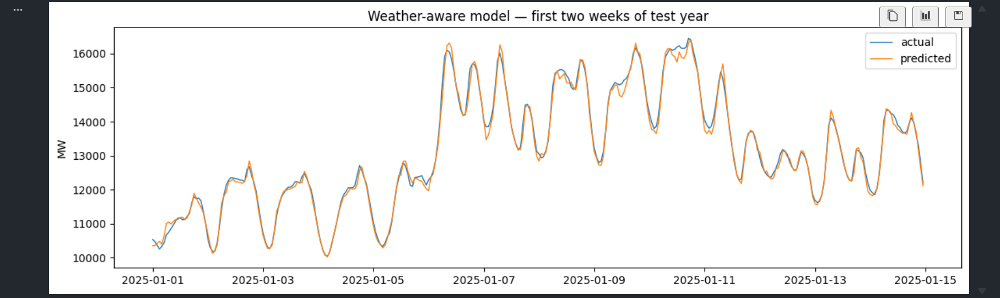
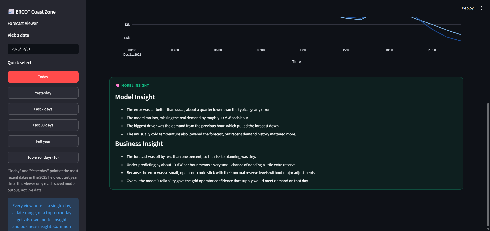

# ERCOT Coast Zone Weather-Aware Load Forecasting

I built this to test a specific, well-known failure mode in electricity demand forecasting: a
model that only looks at calendar and load history looks fine on an average day, then quietly gets
worse right when it matters most — on the hottest and coldest days, exactly when a grid operator's
forecast accuracy affects real dispatch and reserve decisions. This project measures that gap on a
real US grid zone, builds a temperature-aware model to close it, and — the part I actually spent
the most time getting right — uses a same-model ablation, not just a feature-importance chart, to
prove any improvement is really coming from weather and not just from switching to a stronger
model.

**🔗 Live app:** [https://ercot-forecasting-rsaebhskhfngq5rwgka6yk.streamlit.app/](https://ercot-forecasting-rsaebhskhfngq5rwgka6yk.streamlit.app/)

[](https://www.python.org/)
[](https://xgboost.readthedocs.io/)
[](https://streamlit.io/)

---

## Key Finding

Adding temperature to the model doesn't move overall forecast accuracy — a same-model ablation
confirms that directly. What it does do is cut the accuracy gap between normal and
extreme-temperature days by more than two-thirds (a 27% relative gap down to 8.5%), making the
model meaningfully more consistent exactly on the days a grid operator's forecast matters most.

## Results at a Glance

| Model | Normal-day MAPE | Extreme-day MAPE |
|---|---|---|
| Baseline — SARIMAX (calendar only) | 70.2% | 24.7% |
| No-weather XGBoost (ablation) | 0.78% | 0.99% |
| Weather-aware XGBoost | 0.83% | 0.90% |

23 extreme days (21 cold, 2 hot) vs. 342 normal days, in the 2025 held-out test year. Full RMSE
numbers and the reasoning behind them are in [Isolating the Weather Effect](#isolating-the-weather-effect)
below.

## Problem Statement

Most time-series tutorials stop at a calendar-only model: fit it on load history, day of week,
month, and a holiday flag, and call it done. That's a reasonable default, and it's also blind to
weather by construction. Electricity demand is driven heavily by heating and cooling load, so the
days a calendar-only model tends to get most wrong are exactly the extreme-heat and extreme-cold
days — which are also the days a grid operator's forecast accuracy matters most.

The obvious fix is to add temperature as a feature. The harder, more useful question — and the one
this project is actually about — is proving that any improvement is genuinely coming from weather,
and not just from switching to a stronger model or adding more features in general.

## My Solution

I built three models on the same ERCOT-load-plus-Houston-weather dataset, all evaluated on the
same held-out year with the same time-ordered split:

1. **Baseline** — SARIMAX on load history and calendar features only, no temperature.
2. **No-weather ablation** — the exact same XGBoost architecture and lag/rolling/calendar features
   as model 3, with temperature removed.
3. **Weather-aware** — the same XGBoost model, plus temperature and how far that temperature is
   from the historical norm for that day of year.

Every day in the test year is also labeled normal or statistically extreme (top/bottom 5% of daily
temperature, computed on training data only), so each model gets scored on both.

A few choices worth explaining:
- **Three models, not two.** A straight baseline-vs-weather-aware comparison can't isolate what
  weather contributes, because those two models also differ in architecture and features beyond
  temperature. The ablation controls for that — more on this below.
- **ERCOT's own static archive files, not a live scrape or a paid API.** ERCOT's servers block
  obviously scripted requests, and a live scrape or an authenticated API is a runtime dependency a
  deployed app shouldn't need. This project downloads the same fixed per-year files ERCOT itself
  publishes, once, locally.
- **No database.** This is a dataframe-driven modeling workflow, not a query-serving one — Parquet
  files are enough.
- **The deployed app never calls ERCOT or the weather API at runtime.** It only reads committed
  model output. Groq is the one exception, and only for generating a new insight on demand — never
  for anything the app needs just to load.



## Isolating the Weather Effect

This is the actual analytical focus of the project, not the forecasting itself.

Splitting the baseline's test-year error by normal vs. extreme-temperature days produced a
surprise: MAPE was 70.2% on normal days but only 24.7% on the 21 cold-extreme days — the opposite
of what I expected. A bias check ruled out the obvious explanation, that the model was just going
flat on those days. The more likely reason: ERCOT's biggest cold-demand spikes are driven by a
handful of well-known events (Winter Storm Uri, February 2021, sits inside the training range),
which may make a calendar-only model unusually well-calibrated for cold extremes specifically.
Only 2 hot days landed in the test year, so the heat side of the idea wasn't really tested either
way.

That result also meant a plain baseline-vs-weather-aware comparison couldn't isolate what weather
contributes, since those two models differ in architecture and features, not just temperature. The
no-weather ablation exists to hold everything else constant — same XGBoost, same lag/rolling/
calendar features, temperature removed — so the gap between it and the weather-aware model is what
weather actually contributes.

Extreme-day thresholds (top/bottom 5% of daily min/max temperature) come from training-year data
only, then get applied as a fixed number to the test year, so the test set never influences what
counts as "extreme" (`compute_extreme_thresholds` in `src/utils.py`). That worked out to below
4.0°C or above 36.0°C — 23 days out of 365 in the 2025 test year, 21 cold and 2 hot.

| Model | Normal-day MAPE | Normal-day RMSE | Extreme-day MAPE | Extreme-day RMSE |
|---|---|---|---|---|
| Baseline — SARIMAX (calendar only) | 70.2% | 11,038 MW | 24.7% | 4,626 MW |
| No-weather XGBoost (ablation) | 0.78% | 174 MW | 0.99% | 201 MW |
| Weather-aware XGBoost | 0.83% | 181 MW | 0.90% | 182 MW |

Full numbers in `outputs/comparison_table.csv` (screenshot in [Screenshots](#screenshots) below).

- **Almost all of the accuracy jump comes from XGBoost, not weather.** Moving from SARIMAX to
  XGBoost cuts MAPE by about 99%, from 67% overall down to under 1% — and the no-weather ablation
  gets that same jump, since it has no weather features either.
- **Weather doesn't improve average accuracy.** The weather-aware model's normal-day MAPE (0.83%)
  is a touch higher than the ablation's (0.78%).
- **Weather does earn its place on the days it's meant for.** Extreme-day MAPE drops from 0.99% to
  0.90% with weather added, and the normal-vs-extreme gap shrinks from 27.0% (relative) to 8.5%.
  Weather makes the model more consistent on the days that matter most, not sharper on average.

SHAP backs this up: temperature ranks 4th of ten features by mean absolute SHAP value, behind the
three most recent load-lag features and ahead of hour-of-day and day-of-week — the expected shape
for a next-hour forecast, where recent load dominates but weather still earns a real share.

## The Streamlit Viewer

Every view in the app — a single day, a 7/30-day range, the full test year, or the 10 highest-error
days — gets its own explanation, computed from real numbers rather than a fixed script.



Each explanation has two parts: a **model insight** (how large the error is relative to that
period's usual performance, and what actually drove it, grounded in real per-hour SHAP
contributions) and a **business insight** (what that error would mean for a grid operator's demand
planning, in general operational-risk terms). The LLM is only ever handed numbers already computed
in Python — actual value, predicted value, temperature deviation, SHAP drivers — and asked to
phrase them, never to calculate or recall them itself.

The most common views (today, yesterday, last 7/30 days, full year, top 10 error days) are
generated ahead of time and cached, so the app has something real to show on first load with no
API key needed. Anything else generates live behind a button and gets cached the moment it's
produced, keyed by the exact date range plus a fingerprint of the numbers used — so a model re-run
invalidates stale entries automatically instead of silently serving an outdated explanation.

## The Data

- **Load:** ERCOT's `Coast` weather zone (Houston area), hourly, 2019–2025 — seven full years,
  downloaded directly from ERCOT's own Hourly Load Data Archives as static per-year files. No
  account needed.
- **Weather:** hourly temperature and humidity from a real Meteostat station near Houston, picked
  programmatically for confirmed data coverage across the full range rather than by distance alone
  (`select_houston_station` in `src/data_pipeline.py`).
- **Join:** on the shared hourly timestamp, localized to `America/Chicago`. Any day without exactly
  24 hourly rows (a daylight-saving transition) gets flagged rather than silently mishandled; short
  gaps (up to 3 hours) are interpolated, longer ones are left as missing rather than guessed.
- **2026 excluded.** The downloaded 2026 archive file fails a CRC check on unzip and is genuinely
  corrupted, not just incomplete — and it would only be a partial year regardless, since the data
  was pulled mid-2026.
- **Split:** the most recent full year (2025) held out as the test set, so it includes both a
  winter and a summer extreme window — 52,608 training rows for the calendar-only baseline; 49,213
  for the two XGBoost models, once the first week is dropped so the longest lag feature (168 hours)
  is always available.
- **Known simplification:** one weather station stands in for the whole Coast zone's weather, which
  isn't a perfect match.
- **Known simplification #2:** Houston's Coast zone load includes a lot of industrial and
  petrochemical demand, which is far less temperature-sensitive than residential demand. That
  dilutes the weather signal somewhat — the U-shaped temperature/load relationship still shows up,
  just with more baseline noise than a purely residential zone would have.

## Tech Stack

| Tool | Role | Why |
|---|---|---|
| Python + pandas | Data pipeline, feature engineering | Standard for this kind of work |
| gridstatus | Parses ERCOT's archive file format | Used purely as a local parser — handles ERCOT's DST/hour-ending conventions without reimplementing them, no network call |
| meteostat | Hourly Houston-area weather | Free, no API key, pulls from NOAA and other public sources |
| statsmodels (SARIMAX) | Calendar-only baseline | Fourier terms + a compact ARIMA error term so it actually finishes fitting on multi-year hourly data |
| XGBoost + SHAP | Weather-aware model, ablation, feature attribution | Handles nonlinear temperature effects well; SHAP makes "what the model actually uses" checkable |
| Groq (`openai/gpt-oss-120b`) | Model + business insights | Fast and free enough to iterate; only ever phrases numbers already computed in Python |
| Streamlit + Plotly | Interactive viewer | Fast to build and deploy for a one-person project |

## Key Features

- Three models compared apples-to-apples on the same held-out year and the same time-ordered
  split: a calendar-only baseline, a no-weather ablation, and the full weather-aware model.
- A leakage-safe extreme-day definition, computed from training-year temperatures only and applied
  as a fixed threshold to the test year — enforced in code, not just described.
- SHAP feature attribution confirms what the weather-aware model actually relies on.
- An interactive viewer: pick a single day, a week, a month, the full test year, or the 10
  highest-error days.
- A two-part explanation for every view — model-side and business-side — generated on demand and
  cached by exact date range.
- The deployed app never calls ERCOT or the weather API at runtime; it only reads committed model
  output, so it loads fast and doesn't depend on any external data source staying up.

## Folder Structure

```
ercot-forecasting/
├── app/
│   └── streamlit_app.py          # the deployed viewer
├── data/
│   ├── raw/                      # ERCOT archive downloads (gitignored, regenerated by download_archive.py)
│   └── processed/
│       ├── load_weather_joined.parquet
│       ├── baseline_test_predictions.parquet
│       ├── no_weather_model_test_predictions.parquet
│       ├── weather_model_test_predictions.parquet
│       └── weather_model_test_shap.parquet
├── docs/
│   └── screenshots/               # notebook and app screenshots used in this README
├── models/
│   ├── weather_xgboost.json
│   └── no_weather_xgboost.json   # baseline SARIMAX saves locally as a .pkl, gitignored
├── notebooks/
│   ├── 01_eda.ipynb
│   ├── 02_baseline_model.ipynb
│   ├── 03_extreme_day_analysis.ipynb
│   └── 04_weather_aware_model.ipynb
├── outputs/
│   ├── comparison_table.csv
│   └── llm_insight_cache.json
├── src/
│   ├── config.py                 # paths, constants, ERCOT archive URLs
│   ├── download_archive.py       # downloads ERCOT's archive files, manual-download fallback
│   ├── data_pipeline.py          # parses, joins, closes hourly gaps, checks DST days
│   ├── utils.py                  # shared metrics + leakage-safe extreme-day logic
│   ├── baseline_model.py         # calendar-only SARIMAX
│   ├── weather_model.py          # weather-aware XGBoost + SHAP + no-weather ablation
│   └── llm_insights.py           # on-demand, cached, two-part explanations
├── .env.example                  # template for GROQ_API_KEY
└── requirements.txt
```

## Running This Locally

```bash
git clone https://github.com/YashShrivastava4/ercot-forecasting
cd ercot-forecasting
python3 -m venv venv
source venv/bin/activate          # on Windows: venv\Scripts\activate
pip install -r requirements.txt
```

The processed data, trained models, and comparison table are already committed to this repo, so
the app runs directly without pulling ERCOT or weather data again:

```bash
streamlit run app/streamlit_app.py
```

The pre-generated views (today, yesterday, last 7/30 days, full year, top 10 error days) work with
no setup. To generate an insight for any other day or range, copy `.env.example` to `.env`, add a
free [Groq API key](https://console.groq.com), and click "Generate insight" for that view in the
app.

To rebuild everything from scratch instead:

```bash
python3 -m src.download_archive   # downloads ERCOT's archive files, prints a manual link for any year that's blocked
python3 -m src.data_pipeline      # parses, joins, saves the processed parquet
python3 -m src.baseline_model     # fits the SARIMAX baseline
python3 -m src.weather_model      # fits the weather-aware model and the no-weather ablation
python3 -m src.llm_insights       # primes the insight cache, needs GROQ_API_KEY
```

Or run the notebooks in order (`01` → `04`) for the full EDA, baseline, extreme-day, and
weather-aware walkthrough.

## Known Limitations

- **Weather doesn't move overall average accuracy** — only extreme-day robustness. Worth being
  upfront about, since it tempers a simpler "the weather-aware model wins" framing.
- **Only 2 hot-extreme days** landed in the 2025 test year, so the heat side of the original idea
  is only lightly tested by this result; the cold side (21 days) is better supported.
- **Single-station weather is a proxy**, not an exact match, for the whole Coast zone.
- **Industrial/petrochemical load in the Coast zone dilutes the temperature signal** compared to a
  purely residential zone.
- **2026 isn't in this dataset.** The downloaded archive is genuinely corrupted, and would only be
  a partial year regardless.
- **Lag features go up to 168 hours (one week)**, which makes this closer to a short-horizon
  forecast than a true day-ahead one.
- **Live insight generation needs a Groq key in the deploy environment.** Without one, the app
  still works — it just only shows the pre-cached views.

## Screenshots

Two that matter most: the live app, and the chart the whole project's hypothesis rests on.
Everything else backing up the numbers above is one click away.





<details>
<summary><b>Model comparison table and SHAP feature importance</b></summary>

#### Baseline vs. no-weather ablation vs. weather-aware — normal vs. extreme days



#### SHAP — what the weather-aware model actually relies on



</details>

<details>
<summary><b>Predicted vs. actual — baseline vs. weather-aware, first two weeks of the test year</b></summary>

#### Baseline (SARIMAX, calendar only)



#### Weather-Aware (XGBoost + temperature)



</details>

<details>
<summary><b>Streamlit app — model and business insight card</b></summary>



</details>

## Dataset & Acknowledgments

- **ERCOT** (Electric Reliability Council of Texas) — hourly load by weather zone, from ERCOT's
  public Hourly Load Data Archives (`ercot.com/gridinfo/load/load_hist`), free and requiring no
  account.
- **Meteostat** — hourly weather observations, aggregating public sources including NOAA, via the
  free `meteostat` Python library, no API key required.

## About Me

I'm Yash Shrivastava, a final-year Electronics & Telecommunication Engineering student at Shri
G.S. Institute of Technology and Science, Indore. I'm building toward Data Analyst, Data Engineer,
and Applied AI/ML roles, and work mainly in Python, SQL, pandas, scikit-learn, XGBoost, and Power
BI, with hands-on GenAI/LLM integration experience like the insight layer in this project.

[LinkedIn](https://www.linkedin.com/in/yash-shrivastava-a84465246/) · [GitHub](https://github.com/YashShrivastava4) · [yash.shrivastava494@gmail.com](mailto:yash.shrivastava494@gmail.com)
