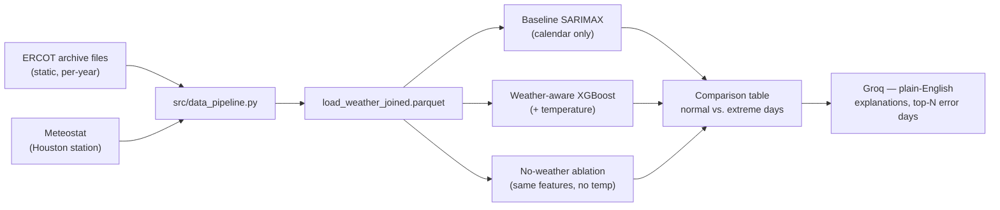

# ERCOT Coast Zone Weather-Aware Load Forecasting

I built this to test a specific, real failure mode in electricity demand forecasting: a
calendar-only model — the kind most time-series tutorials stop at — looks fine on an average day
and quietly gets worse exactly when it matters most, on statistically extreme-temperature days,
because it has no concept of weather. This project measures that gap on a real US grid zone, then
builds a temperature-aware model to close it, and uses a same-model no-weather ablation (not just
feature-importance ranking) to confirm the improvement is actually because of temperature, not a
side effect of switching model families.

**Status:** the data pipeline is built and verified end to end. The modeling notebooks and the LLM
explanation layer are written but not yet run — see [Current Status](#current-status) below before
trusting any number that isn't already filled in.

[](https://www.python.org/)
[](https://xgboost.readthedocs.io/)
[](https://streamlit.io/)

---

## Current Status

| Deliverable | Status |
|---|---|
| Data layer (ERCOT + Houston weather, joined) | **Done** |
| EDA and seasonal decomposition | Written, not yet run |
| Calendar-only SARIMAX baseline | Written, not yet run |
| Extreme-day error analysis | Written, not yet run |
| Weather-aware XGBoost model + SHAP + no-weather ablation | Written, not yet run |
| LLM plain-language explanations (Groq) | Written, not yet run |
| Streamlit viewer (optional) | Written, not yet run |

Full build history and the reasoning behind every design decision below are in `progress_report.md`
and `notes.md` in this repo — written as a running technical record, not polished for public
reading, but the most complete answer to "what actually happened building this."

## Result

*(fill in once the full pipeline has been run — this is the one line that matters)*

> Built a weather-aware electricity demand forecasting model on real ERCOT (Texas grid) data;
> identified that a calendar-only baseline underperformed by **[X]%** on statistically extreme
> temperature days, and a temperature-aware XGBoost model closed **[Y]%** of that gap specifically
> because of weather — isolated with a same-model no-weather ablation, not just SHAP ranking — with
> an LLM-generated plain-language explanation layer for the highest-error forecast days.

The comparison table backing this number (baseline, no-weather ablation, and weather-aware, each
split by normal vs. extreme days) will be saved to `outputs/comparison_table.csv` once
`notebooks/04_weather_aware_model.ipynb` has been run.

## Problem Statement

Standard time-series forecasting — SARIMA/Prophet on load history plus calendar features — is a
reasonable default, and it's also weather-blind by construction. Electricity demand is driven in
large part by heating and cooling load, which means the days a calendar-only model handles worst
are exactly the extreme-heat and extreme-cold days where an accurate forecast actually matters
operationally, for grid reliability and dispatch. That's not a hypothetical gap; it's the specific,
documented failure mode this project sets out to measure and then fix.

The interesting part isn't "does adding temperature help" — it obviously should. It's proving *how
much* it helps specifically on the days it needs to, and proving the improvement is actually
attributable to weather rather than just a better model family or more features in general.

## My Solution

Two forecasting models on the same joined ERCOT-load-plus-Houston-weather dataset: a calendar-only
SARIMAX baseline (no temperature at all), and an XGBoost model that adds temperature, temperature
deviation from that day-of-year's historical norm, and lag/rolling load features. Both are
evaluated on the same held-out year, split into normal days and statistically extreme-temperature
days (top/bottom 5% by training-data percentile, never computed on test data). A third model — a
no-weather XGBoost ablation, same features minus temperature — isolates what weather specifically
contributes, separate from the jump in model family.

A few choices worth explaining:
- **ERCOT's own static per-year archive files, not a live scrape or an authenticated API.**
  `gridstatus`'s free scraping method returned 403 during development. Rather than depend on a live
  authenticated API (a runtime credential a deployed app would also need) or a scraped page's link
  list (which breaks the moment ERCOT reorders that page), this project downloads the same fixed
  archive files ERCOT itself publishes at stable URLs, once, locally — see `notes.md` for the full
  record.
- **No database.** This is a dataframe-driven modeling workflow, not a query-serving one — Parquet
  files are enough, and a DB would add complexity with no real benefit here.
- **SARIMAX, parameterized for hourly, multi-year data, not textbook seasonal SARIMA.** A seasonal
  ARIMA with a 24-hour period doesn't fit in practical time via `statsmodels`'s state-space solver
  on several years of hourly data — a compact ARIMA(2,1,2) error term plus Fourier terms and
  calendar dummies gets the same calendar-only information into a model that actually finishes
  fitting.
- **A no-weather ablation model, not just SHAP.** The baseline and the weather-aware model already
  differ in model family and feature set beyond just temperature — SHAP alone can show what the
  trained model leans on, but can't rule out that the improvement over baseline came from switching
  to XGBoost rather than from weather specifically. The ablation controls for that directly.



## Isolating the Weather Effect

This is the actual analytical focus of the project, not the forecasting itself — a weather-aware
model beating a weather-blind one is expected. The harder, more useful question is proving *why*:

1. **Segment by extreme day, not just overall error.** Both models are scored separately on normal
   days and on statistically extreme-temperature days (thresholds set from training data only,
   applied fixed to the test set — enforced in `src/utils.py`, not just claimed).
2. **SHAP confirms what the trained model actually leans on.** If temperature-related features
   don't rank highly, the "it's the weather" story doesn't hold regardless of the headline number.
3. **The no-weather ablation isolates the causal claim.** Same XGBoost, same lag/rolling/calendar
   features, temperature removed. The gap between this model and the full weather-aware model —
   not the gap between baseline and weather-aware — is what's actually attributable to weather,
   since it's the only thing that differs between those two runs.

## The Data

- **Load:** ERCOT's `Coast` weather zone (Houston area), 2019–2025, from ERCOT's own
  Hourly Load Data Archives — static per-year files, no account needed. 2026 was excluded: the
  downloaded archive file is genuinely corrupted (reproducible `zipfile.BadZipFile: Bad CRC-32`
  error) and would only be a partial year regardless.
- **Weather:** hourly temperature and humidity from a real meteostat station near Houston,
  selected programmatically for confirmed data coverage across the full range rather than picked
  by distance alone.
- **Known simplification:** a single station is a proxy for the whole Coast zone's weather, not a
  perfect match.
- **Known simplification #2:** Houston's Coast zone load includes significant
  industrial/petrochemical demand, which is much less temperature-sensitive than
  residential/commercial demand — this dilutes the weather signal somewhat. The U-shaped
  temperature-load relationship should still show up, just with more baseline noise than a purely
  residential zone would have.

## Tech Stack

| Tool | Role | Why |
|---|---|---|
| Python + pandas | Data pipeline, feature engineering | Standard for this kind of work |
| gridstatus | Local parser for ERCOT's archive file format | Handles ERCOT's DST/hour-ending conventions without reimplementing them; makes no network call in this project |
| meteostat | Hourly Houston-area weather | Free, no API key, pulls from NOAA and other public sources |
| statsmodels (SARIMAX) | Calendar-only baseline | Parameterized to actually fit on multi-year hourly data, see `notes.md` |
| XGBoost + SHAP | Weather-aware model + feature attribution | Handles nonlinear temperature effects well; SHAP makes the "why" checkable |
| Groq (`openai/gpt-oss-120b`) | Plain-language explanations for worst-error days | Same model already validated in Project 2; fast and free enough to iterate |
| Streamlit (optional) | Day-by-day viewer | Lowest priority per the original scope — only worth building with time to spare |

## Key Features

- A verified, leakage-safe extreme-day definition — computed from training data only, enforced in
  code.
- Two models compared apples-to-apples on the same held-out year, same time-ordered split.
- A no-weather ablation model that isolates weather's actual contribution, not just a SHAP ranking.
- Plain-English, fact-grounded explanations for the highest-error forecast days — the LLM only
  phrases numbers already computed in Python, never asked to calculate or recall them itself.
- A data pipeline with a documented, working fallback for ERCOT's own scripted-request blocking, so
  a single blocked download can't stall the whole project.

## Folder Structure

```
ercot-forecasting/
├── app/
│   └── streamlit_app.py          # optional day-by-day viewer, not yet run
├── data/
│   ├── raw/
│   │   └── manual_archive/       # downloaded ERCOT per-year archive files (gitignored)
│   └── processed/
│       └── load_weather_joined.parquet   # committed — the deployed app is meant to read this directly
├── models/                       # saved baseline / weather-aware / ablation models (not yet populated)
├── notebooks/
│   ├── 01_eda.ipynb
│   ├── 02_baseline_model.ipynb
│   ├── 03_extreme_day_analysis.ipynb
│   └── 04_weather_aware_model.ipynb
├── outputs/                      # comparison_table.csv, llm_explanations.csv (not yet populated)
├── src/
│   ├── config.py                 # paths, constants, ERCOT archive URL map
│   ├── download_archive.py       # auto-download of ERCOT's archive files, manual fallback
│   ├── data_pipeline.py          # parses archive + weather, joins, closes hourly gaps
│   ├── utils.py                  # shared metrics + leakage-safe extreme-day logic
│   ├── baseline_model.py         # calendar-only SARIMAX
│   ├── weather_model.py          # XGBoost weather-aware model + SHAP + no-weather ablation
│   └── llm_insights.py           # plain-English explanations for the worst forecast days
├── .env.example                  # template for GROQ_API_KEY
└── requirements.txt
```

## Running This Locally

```bash
git clone https://github.com/YashShrivastava4/ercot-forecasting
cd ercot-forecasting
python3 -m venv venv
source venv/bin/activate          # on Windows: venv\Scripts\activate
pip install -r requirements.txt
```

The processed data (`data/processed/load_weather_joined.parquet`) is already committed to this
repo, so the notebooks can be run directly without pulling ERCOT or meteostat data again. To
regenerate it from scratch instead:

```bash
python3 -m src.download_archive   # downloads ERCOT's archive files, prints a manual-download link for any year that's blocked
python3 -m src.data_pipeline      # parses, joins, saves the processed parquet
```

Then run the notebooks in order (`01` → `04`), and, if you want the LLM explanation layer, copy
`.env.example` to `.env`, add a free [Groq API key](https://console.groq.com), and run:

```bash
python3 -m src.llm_insights
```

## Known Limitations

- **Single-station weather is a proxy, not an exact match, for the whole Coast zone.**
- **Industrial/petrochemical load in the Coast zone dilutes the temperature signal** relative to a
  purely residential zone — expected, not a bug.
- **2026 isn't in this dataset.** The downloaded archive is genuinely corrupted, and it would only
  be a partial year regardless — see `notes.md` for the verification.
- **Lag features go up to 168 hours (one week)**, which makes this closer to a short-horizon /
  nowcasting setup than a true day-ahead forecast — worth being explicit about if it comes up.
- **Results aren't in yet.** The data layer is verified; the modeling notebooks, the comparison
  table, and the LLM explanation layer are written but not yet executed. Treat every `[X]`/`[Y]` in
  this README as a placeholder until `outputs/comparison_table.csv` exists.

## Dataset & Acknowledgments

- **ERCOT** (Electric Reliability Council of Texas) — hourly load by weather zone, from ERCOT's
  public **Hourly Load Data Archives** (`ercot.com/gridinfo/load/load_hist`), free and requiring no
  account.
- **Meteostat** — hourly weather observations for a station near Houston, aggregating public
  sources including NOAA, via the free `meteostat` Python library, no API key required.

## About Me

I'm Yash Shrivastava, a final-year Electronics & Telecommunication Engineering student building
toward a data analyst role. This is the third project in my portfolio, alongside a CLV +
segmentation project on the OLIST dataset and an IT service-desk analytics + NL-to-SQL chatbot on
ServiceNow data.

[LinkedIn](https://www.linkedin.com/in/yash-shrivastava-a84465246/) · [GitHub](https://github.com/YashShrivastava4) · [yash.shrivastava494@gmail.com](mailto:yash.shrivastava494@gmail.com)
